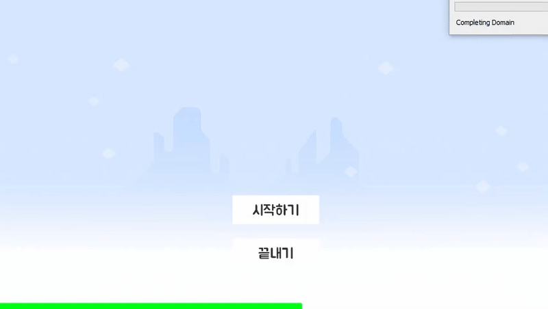
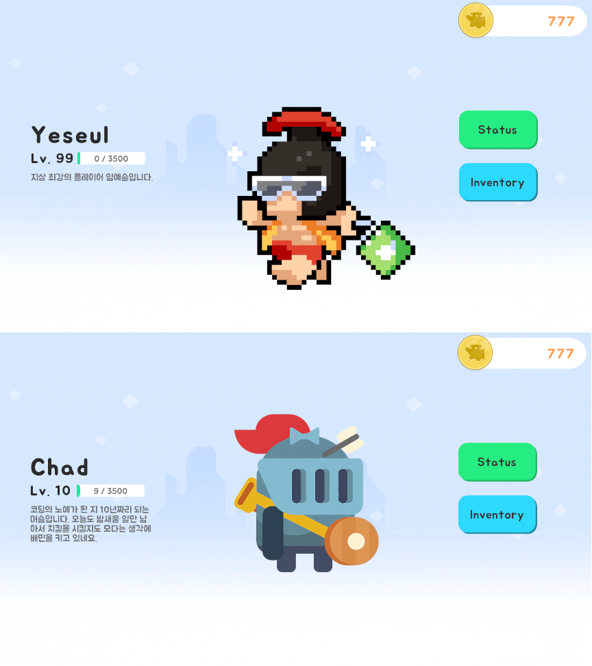
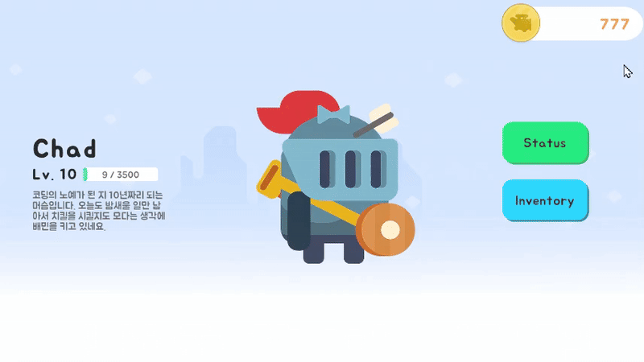
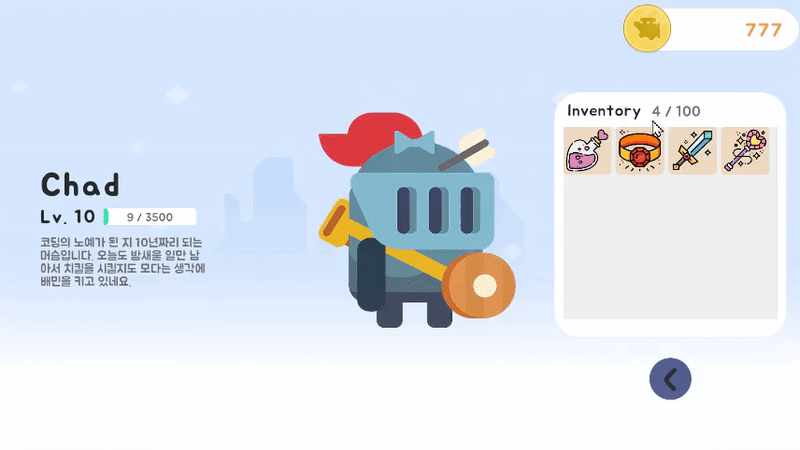
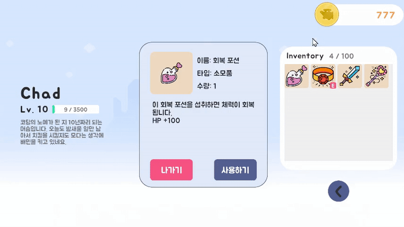

# 🎒 UI 인벤토리 시스템

Unity 기반 UI 인벤토리 시스템을 구현한 프로젝트입니다.  
캐릭터 정보 기반의 동적인 UI 출력과 아이템 상호작용 기능을 포함하며,  
모듈화된 구조와 비동기 리소스 로딩을 통해 유연한 확장성과 최적화를 고려하였습니다.

---

## 📌 개발 정보

- **개발 환경**: Unity 2022.3.17f1  
- **개발 기간**: 2025.06.06 ~ 2025.06.10  
- **플랫폼**: Windows, MacOS

---

## 🧩 주요 기능

### 1. Title 화면
- 리소스 비동기 로딩 완료 후 `Start` 버튼 활성화  
- 

### 2. Lobby 화면
- 현재 캐릭터의 상태 정보를 기반으로 UI 출력  
- 

### 3. Status 화면
- 캐릭터의 능력치, 레벨 등을 표시  
- 

### 4. Inventory 화면
- 보유 중인 아이템을 리스트로 표시
- 
- 아이템 클릭 시 Info Popup 창 출력  
- 

### 5. Item Info 화면
- 선택된 아이템의 상세 정보 표시
- 
- 아이템 타입에 따라 버튼 (장착/해제/사용) 동적으로 표시
- 
- 동일 타입 장비 장착 시 기존 장비 자동 해제
- 
- 사용 가능한 소모품이 없을 경우 Toast 메시지 출력  
- 

---

## 🛠 사용 기술 스택

- **DOTween** – UI 애니메이션  
- **Addressable Asset System** – UI 프리팹 및 리소스 관리  
- **ScriptableObject** – 캐릭터 및 아이템 데이터 관리  

---

## 🔗 더 자세한 설명은?

👉 [블로그에서 자세히 보기](https://three-333.tistory.com/470)

